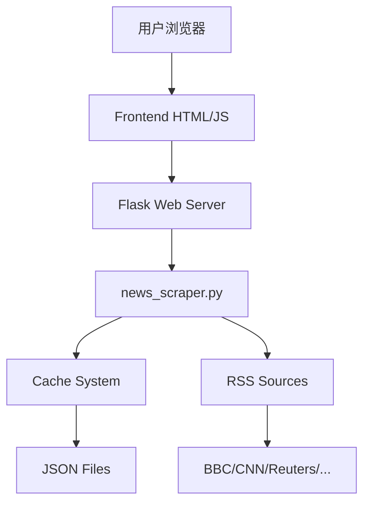

# 世界新闻汇总爬虫项目

本工程演示了一个高效的新闻聚合系统，通过网络爬虫抓取多个国际新闻源的 RSS 提要，集成智能缓存机制，对内容进行摘要并通过现代化 Web 界面呈现。整个项目采用前后端分离架构，支持实时数据更新和优雅的用户体验。

## 核心功能

### 🌍 多源新闻聚合
从主流国际媒体的 RSS 提要中抓取最新新闻，包括：
- **BBC** - 英国广播公司
- **CNN** - 美国有线电视新闻网
- **Reuters** - 路透社
- **The Guardian** - 英国卫报
- **Al Jazeera** - 半岛电视台
- **AP** - 美联社
- **NPR** - 美国国家公共电台
- **DW** - 德国之声

### 🚀 智能缓存系统
- **文件缓存机制**：减少对新闻源的频繁访问，提升响应速度
- **自动过期管理**：缓存5分钟自动更新，确保内容时效性
- **故障容错**：单个源失效不影响其他源的正常工作

### 📊 内容处理
- **智能摘要生成**：基于词频分析的摘要算法，提取关键信息
- **HTML标签清理**：自动移除RSS内容中的HTML标记
- **多语言支持**：支持中西文混合内容处理

### 🎨 现代化界面
- **响应式设计**：完美适配桌面和移动设备
- **实时加载状态**：优雅的加载动画和进度提示
- **错误处理**：详细的错误分类和用户友好的提示信息
- **自动刷新**：支持手动刷新和5分钟自动更新
- **键盘快捷键**：F5 或 Ctrl+R 快速刷新

### 🔧 技术特性
- **RESTful API**：标准化的 `/api/news` 接口
- **配置文件管理**：集中式新闻源配置，便于维护扩展
- **HTTPS优先**：所有新闻源均使用安全连接
- **异步处理**：前端采用现代 async/await 语法

## 项目结构

```
news_scraper_project/
├── backend/
│   ├── app.py          # Flask 应用入口，提供 API 和静态页面服务
│   ├── news_scraper.py # 新闻爬虫、缓存管理与摘要逻辑
│   ├── config.py       # 配置文件：新闻源、缓存设置等
│   └── cache/          # 缓存目录（运行时自动创建）
├── frontend/
│   └── index.html      # 现代化前端页面，支持实时更新和错误处理
├── requirements.txt    # Python 依赖列表
└── README.md           # 项目说明文件
```

## 快速开始

### 环境要求
- **Python 3.8+** （推荐 Python 3.9 或更高版本）
- **稳定的网络连接** （用于访问国际新闻源）

### 1. 安装依赖

进入项目根目录执行：

```bash
pip install -r requirements.txt
```

### 2. 启动服务

进入后端目录并启动 Flask 应用：

```bash
cd backend
python app.py
```

服务启动后将在 `http://127.0.0.1:5000` 提供服务。

### 3. 访问应用

在浏览器中打开 `http://127.0.0.1:5000/`，即可体验现代化的新闻汇总界面。

### 4. API 使用

直接访问 `http://127.0.0.1:5000/api/news` 获取 JSON 格式的新闻数据。

## 使用说明

### 界面操作
- **刷新按钮**：手动获取最新新闻
- **自动更新**：每5分钟自动刷新一次
- **快捷键**：F5 或 Ctrl+R 快速刷新
- **响应式**：支持手机、平板、桌面等各种设备

### 缓存机制
- 首次访问会从所有新闻源获取数据（较慢）
- 后续5分钟内的访问将使用缓存（快速响应）
- 缓存文件存储在 `backend/cache/` 目录下
- 支持单独更新失效的新闻源

## 依赖说明

### 核心依赖
- **Flask >= 2.3.0**：轻量级 Web 框架，提供 API 服务和静态文件托管
- **requests >= 2.28.0**：HTTP 库，用于获取 RSS 提要内容

### 标准库使用
- **xml.etree.ElementTree**：RSS XML 解析
- **json**：缓存文件序列化
- **os/time**：文件系统和时间管理
- **re**：正则表达式处理
- **collections.Counter**：词频统计

项目最小化依赖设计，避免过度复杂的外部库。

## 高级配置

### 自定义新闻源

编辑 `backend/config.py` 文件中的 `FEED_SOURCES` 列表：

```python
FEED_SOURCES = [
    ("新闻源名称", "RSS链接"),
    ("示例新闻", "https://example.com/rss.xml"),
    # 添加更多新闻源...
]
```

### 缓存设置

在 `config.py` 中调整缓存参数：

```python
CACHE_DURATION = 300      # 缓存时长（秒）
MAX_ITEMS_PER_SOURCE = 5  # 每个源的最大新闻数
REQUEST_TIMEOUT = 10      # 请求超时时间
```

## 性能优化

### 已实现的优化
- ✅ **智能缓存**：减少重复请求，提升响应速度
- ✅ **异步前端**：非阻塞用户界面更新
- ✅ **错误隔离**：单个源失效不影响整体功能
- ✅ **资源优化**：最小化依赖和内存使用

### 扩展建议

1. **数据库集成**
   - 使用 SQLite 或 PostgreSQL 存储历史新闻
   - 实现新闻去重和趋势分析

2. **高级摘要算法**
   - 集成 TextRank 或 BERT 等 NLP 模型
   - 支持多语言摘要生成

3. **用户个性化**
   - 添加用户偏好设置
   - 实现新闻分类和过滤

4. **监控和分析**
   - 添加 Prometheus/Grafana 监控
   - 实现访问统计和性能分析

5. **部署优化**
   - Docker 容器化部署
   - 使用 Redis 作为分布式缓存
   - Nginx 反向代理和负载均衡

## 故障排除

### 常见问题

**Q: 新闻加载缓慢或失败**
- 检查网络连接是否正常
- 某些国际新闻源可能需要代理访问
- 查看控制台错误信息定位具体问题

**Q: 缓存文件过大**
- 可以定期清理 `backend/cache/` 目录
- 调整 `MAX_ITEMS_PER_SOURCE` 参数

**Q: 部分新闻源无法访问**
- RSS 源链接可能变更，请更新 `config.py`
- 某些源可能有访问限制或需要用户代理

## 技术架构



## 更新日志

### v2.0 (当前版本)
- ✨ 新增智能缓存系统
- 🎨 全新现代化 UI 设计
- 📱 响应式移动端适配
- 🔧 配置文件管理
- 🛡️ 增强错误处理
- ⚡ 性能大幅提升

### v1.0 (原始版本)
- 基础新闻聚合功能
- 简单摘要算法
- 基础 Web 界面

## 许可证

本项目采用 MIT 许可证，详见 LICENSE 文件。

## 贡献指南

欢迎提交 Issue 和 Pull Request！请确保：
- 代码符合 PEP 8 规范
- 添加适当的测试用例
- 更新相关文档

---

**🎉 祝您使用愉快！如有问题请提交 Issue。**
